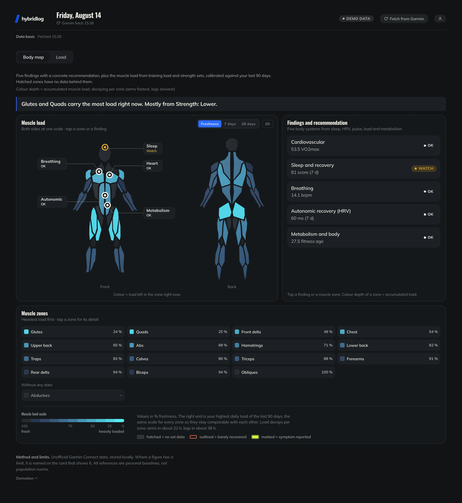
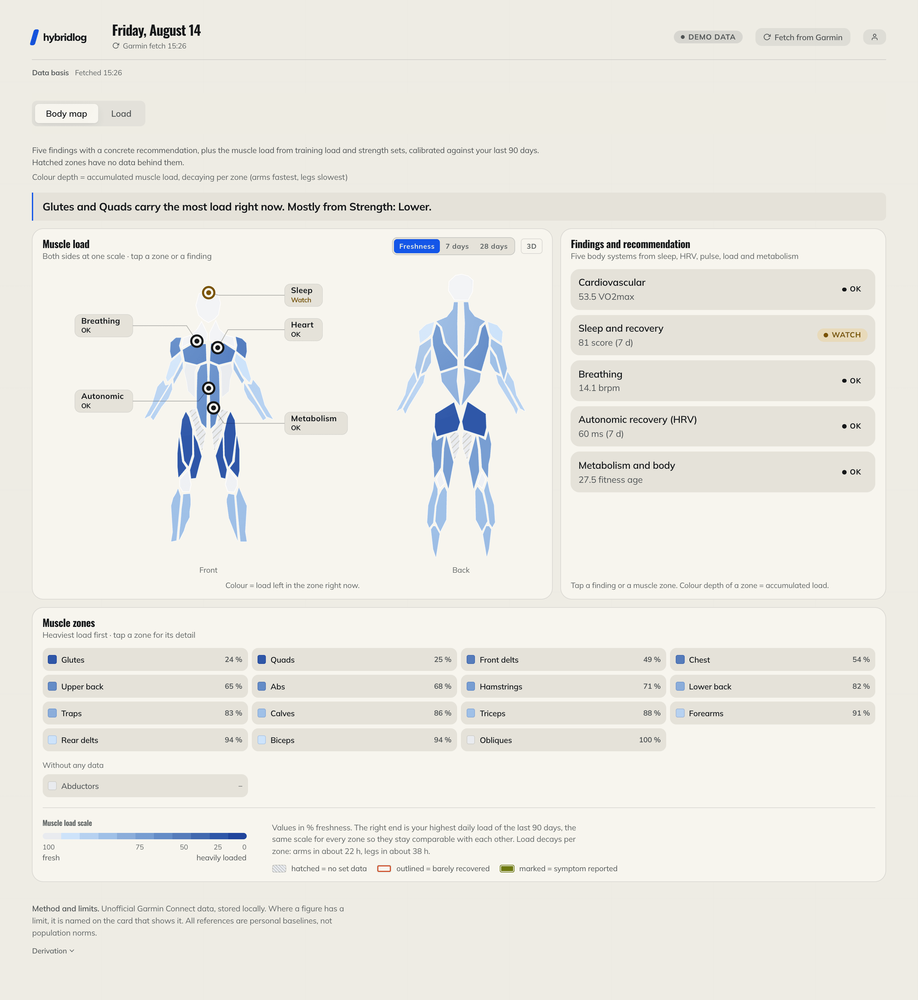
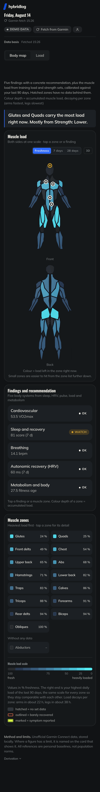

# hybridlog

[](https://github.com/Imgrund/hybridlog/actions/workflows/tests.yml)
[](LICENSE)
[](https://github.com/Imgrund/hybridlog/releases)
[](https://registry.modelcontextprotocol.io/v0/servers?search=io.github.Imgrund/hybridlog)

Self-hosted MCP server on your own Garmin data. It mirrors everything
Garmin answers into a database you control, computes the models the watch
does not (training load, muscle freshness, readiness in context), and
hands all of it to a language model over stdio or HTTP, so the things
Garmin cannot measure can be dictated into the chat instead of typed into
a form. A dashboard comes with it: the body map, the training load, and
the login the connector authenticates against. There is no hosted
instance, and that is the point: it is a health record, and the model
reads it through a role that can only read.

Running, lifting or both on the same day: the models do not care which.
Sessions that alternate running with station work get a lap-by-lap
breakdown of their own, which is the shape of a HYROX race.

There is a [demo](https://hybridlog-demo-production.up.railway.app) to
walk through before installing anything: sign in as `demo@example.com`
with the password `demo-demo-demo`. It runs on generated data and puts
itself back every night.



<table>
<tr>
<td width="64%">



</td>
<td width="36%">



</td>
</tr>
</table>

<sub>Every number in these three is generated by `fetcher/seed_demo.py`.
The interface is English and ships a German translation; it follows the
browser language unless the profile says otherwise.</sub>

> **Read this before you rely on it.** The fetcher talks to Garmin
> Connect's *unofficial* web API. Garmin can change or close it without
> notice. This project is not affiliated with or endorsed by Garmin.
> Nothing it computes is a medical statement: readiness, HRV bands, load
> ratios and the coach texts are training aids, not diagnoses. It is a
> personal project published in the hope it is useful, with no promise of
> support or a stable interface.

## What it is

- **MCP server**: thirteen tools and one prompt over `laravel/mcp`, in two
  transports. Local (stdio) for Claude Code and Claude Desktop, hosted
  (streamable HTTP with OAuth 2.1, PKCE and dynamic client registration)
  for claude.ai, ChatGPT, Mistral's Le Chat (renamed Vibe), LM Studio and
  anything else that speaks it.
- **Dashboard**: Laravel + Alpine + Chart.js. It draws the body map and
  the training load, and it is also the login the connector authenticates
  against and the place where you set what the chat may see.
- **Fetcher**: Python (`fetcher/`), pulls daily metrics and activities via
  [python-garminconnect](https://github.com/cyberjunky/python-garminconnect)
  into one athlete's schema of a PostgreSQL database, which both of the
  above read through a connection that may only read it, and only that
  athlete's. Each answer is also kept whole beside the columns read out of
  it, so a field nobody has built a column for is still there to be asked
  about, and a day Garmin Connect no longer serves is still in the mirror.

What *no hosted instance* means in practice: the Garmin session sits in
a schema of your own database that no reader role can reach, so the SQL
a model writes cannot ask for it, and no operator but you holds it. Past Garmin itself, two optional things
reach out at all: the weather, which takes a pair of coordinates you fill
in yourself, and notifications, where the push service is woken by an
empty POST and never carries what it was about.

## The tools

Thirteen tools and one prompt. The right-hand column is the switch at
`/connect` that gates each one; everything is on by default.

| Tool | What it answers | Needs |
| --- | --- | --- |
| `get-health-summary-tool` | the current picture in one call: readiness, sleep, load, data freshness | Read health data |
| `get-insights-tool` | the app's own verdict per body system, with the recommendation and the early illness pattern | Read health data, Read body metrics |
| `get-muscle-map-tool` | per-zone freshness, weekly volume per zone, what to train today | Read health data |
| `get-training-load-tool` | CTL/ATL/TSB, the acute:chronic ratio, the weekly stimulus split | Read health data |
| `get-strength-progress-tool` | week by week per exercise category: reps, tonnage where it was recorded, top weights, what has not moved | Read health data |
| `get-race-splits-tool` | one session lap by lap: running vs. station work, pace per lap, how far the pace drifted | Read health data |
| `get-activity-detail-tool` | one session in depth: zone minutes and shares against the athlete's zone floors, laps, sets, the heart-rate curve, and how it compares with earlier sessions of its kind | Read health data |
| `describe-schema-tool` | the mirror's tables and columns, so the model can write its own query | Read health data, Read body metrics |
| `query-health-data-tool` | everything else, as one read-only SELECT with a 500-row cap | Read health data, Read body metrics |
| `refresh-data-tool` | syncs today and yesterday from Garmin (the header button's job, narrowed to two days) and waits for it | Start a fetch |
| `log-symptom-tool` | a strain mentioned in passing, as a marker on the body map | Log how you feel |
| `delete-symptom-tool` | takes one off again once it has healed | Log how you feel |
| `give-feedback-tool` | a correction that becomes a standing guideline for the connector | Process feedback |
| `weekly-report` (prompt) | drives the Sunday review; the report is the conversation's answer and is stored nowhere | Read health data |

Most of them answer a question the app was built around. Two do not:
`describe-schema` hands the model the mirror's own tables with the
comments that say what each column means, and `query-health-data` runs
the SELECT it writes from that. It is the difference between a set of
reports and a database somebody can think in, and it is what makes
keeping the raw answers worth the disk: a field nobody has promoted to a
column is still one question away.

Reading is the whole of it, with one documented exception. Symptoms are
the only thing the chat may write, and they go to the app's own schema,
never into the Garmin mirror. Free-form SQL runs through
`app/Garmin/ReadOnlyGarminQuery`: a single SELECT or WITH, a keyword
blocklist, a read-only transaction, a row cap, on a connection switched
into a role that holds SELECT on one athlete's schema and nothing else.

## Quickstart (Docker, demo data, no Garmin account)

```bash
git clone https://github.com/Imgrund/hybridlog.git
cd hybridlog
cp .env.example .env
docker compose up -d
```

That brings up PostgreSQL, the dashboard, a queue worker and a scheduler.
The published image covers amd64 and arm64, so the first start downloads
rather than compiles. After a `git pull`, plain `up -d` keeps running the
image it already has: the new code arrives only with `--build`.

Then fill the mirror with 120 days of plausible data, create the account
you log in with, and open the dashboard:

```bash
docker compose exec app /opt/fetcher/bin/python fetcher/seed_demo.py
docker compose exec app php artisan app:create-user you@example.com --admin
open http://localhost:8080
```

There is no sign-up page, on purpose: a login nobody can register at has
no surface to attack. For anybody but yourself, hand over a link instead
of a password:

```bash
docker compose exec app php artisan app:invite them@example.com --name="Them"
```

It prints a one-time link, good for seven days (`--days`), on which they
set their own password. `--admin` marks the installation owner, who is
the account the local stdio transport acts for. Every account keeps its
own profile, permissions, symptom log, Garmin sign-in, notifications and
mirror, and sees none of anybody else's.

`DEMO_MODE=true` turns an installation into a shop window instead: one
shared account, everything that would reach out of it closed (the Garmin
sign-in above all), and `php artisan demo:reset` putting it back nightly.

A shop window is also the one place worth counting visitors in, and
`UMAMI_SCRIPT_URL` plus `UMAMI_WEBSITE_ID` render the script tag of an
[Umami](https://umami.is) instance you host yourself: page views without
a cookie and without an identifier that follows anyone off the site.
Both lines are needed, and with either empty, which is the default,
nothing is rendered at all and no page requests a host but this one. It
is not tied to `DEMO_MODE`, so a private installation stays free of
outside scripts by simply leaving them alone.

## Connect an AI

The server reads the same mirror the dashboard draws from, so a chat and
the page never disagree. What the page cannot do is answer a question it
was not built for: how this week stands against the one before, whether
today is a rest day, what a niggle means for tomorrow.

> [!IMPORTANT]
> This hands a language model your health record. It reads through a role
> that may only read, and only your own schema, but it reads all of it.
> Which parts is yours to set at `/connect`, per switch, and the switches
> take effect on the next tool call rather than the next reconnect.

One address, the same for every client:

```
https://<your-domain>/mcp/garmin
```

Claude, ChatGPT, Langdock, Le Chat and LM Studio all take it and run OAuth
against the dashboard's own login, so no client ever sees a password and
`/connect` can cut any of them off again. Claude Code and Claude Desktop
can skip the deployment entirely and talk to the repository over stdio.
[docs/connect-ai.md](docs/connect-ai.md) has the steps per client.

Whichever way it connects, it gets [the same thirteen tools](#the-tools) and
the same switches.

Things worth asking, once it is connected:

> How did my training week compare with the one before?
>
> Am I ready for a hard session, or do I need a rest day?
>
> Which muscles are fresh, and what should I train today?
>
> Where did my pace go in Saturday's race, and how much of the clock was
> station work?
>
> My left knee hurt on the box jumps.

## Setup with your own Garmin account

Sign in under *Garmin* in the account menu, or at `/connect/garmin`:
email, password, and the MFA code if Garmin asks for one. What is stored
is an OAuth token pair, never the password. The sign-in runs on a queue
worker, so one has to be up.

A first sign-in fills the mirror by itself: a ninety-day backfill on the
queue, roughly a quarter of an hour, with the page filling in as the
history lands. Ninety days is about the minimum for the models to say
anything, since the HRV baseline needs three weeks of nights and the load
ratios a rolling six weeks. From then on the scheduler fetches three
times a day and the *Fetch from Garmin* button fetches on demand.

Every command works on one athlete (`--tenant <user id>`, the owner where
left out). Details, backfills and the manual login are in
[docs/install.md](docs/install.md); how to record so the data is worth
reading is in [docs/recording.md](docs/recording.md).

## Documentation

- [docs/install.md](docs/install.md): installing without Docker,
  deploying to a platform, backup.
- [docs/connect-ai.md](docs/connect-ai.md): every client's steps, OAuth
  and discovery, running the MCP server on a public host.
- [docs/recording.md](docs/recording.md): recording rules, weather,
  notifications.

## Architecture notes

- Derived metrics (CTL/ATL/TSB, ACWR fallback, muscle freshness with a
  ~28 h half-life self-calibrated against 90-day history) are computed on
  the fly in `app/Garmin/`.
- The `garmin` connection is separate from Laravel's default one. It
  points at the same database, but is aimed at one athlete's schema per
  query: `App\Garmin\Mirror` sets `search_path` to `garmin_t{id}` and
  switches into that tenant's read-only role before the first statement.
- The interface language is the one thing the athlete still enters, on
  `/profile`, stored in the database rather than in `.env`: it belongs to
  the athlete rather than to the deployment.
- Colors follow a validated dataviz palette (light + dark via
  `prefers-color-scheme`), roles defined in `resources/css/app.css`.

## Contributing

Releases are tagged, and [CHANGELOG.md](CHANGELOG.md) says what changed in
each one. [CONTRIBUTING.md](CONTRIBUTING.md) says how to run the suite,
what the tests will hold you to, and which changes are deliberately out of
scope. Conduct is covered in [CODE_OF_CONDUCT.md](CODE_OF_CONDUCT.md).
Security problems do not belong in an issue: [SECURITY.md](SECURITY.md)
has the private path.

## License

MIT, see [LICENSE](LICENSE). The muscle polygons in
`resources/data/body-polygons.json` come from the
[body-highlighter](https://github.com/lahaxearnaud/body-highlighter)
project family and are MIT-licensed as well.

Two bundled assets carry their own terms. The 3D figure
`resources/models/body-zones.glb` is an adaptation of BodyParts3D
(© The Database Center for Life Science) and stays under
CC Attribution-Share Alike 2.1 Japan;
[resources/models/CREDITS.md](resources/models/CREDITS.md) carries the
full credit and what the license binds. The Mulish and Oswald fonts in
`resources/fonts/` are under the SIL Open Font License 1.1, whose texts
ship next to them.
